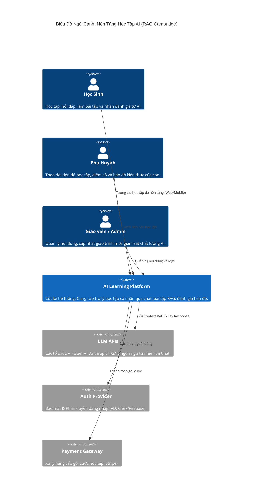
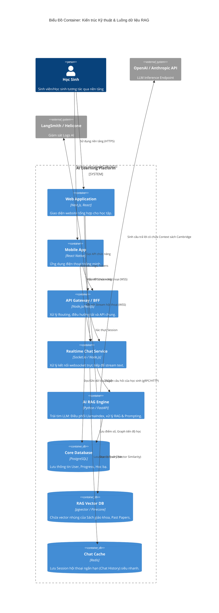

# Kiến Trúc Hệ Thống Nền Tảng Học Tập AI

Tài liệu này mô tả sơ đồ kiến trúc hệ thống dựa trên mô hình C4 (Context & Container) để trực quan hoá luồng dữ liệu của nền tảng ứng dụng RAG và giáo trình Cambridge.

---

## 1. Biểu Đồ Ngữ Cảnh Hệ Thống (System Context - L1)
*Biểu đồ này cho thấy hệ thống của chúng ta tương tác với ai (người dùng) và cái gì (hệ thống bên ngoài).*

---

## 2. Biểu Đồ Container (Container Diagram - L2)
*Biểu đồ này "bóc tách" Hệ thống (Platform) thành các khối chạy (containers) bao gồm Frontend, Backend, AI Engine và Database.*

---

## 3. Luồng Xử Lý Điển Hình (Ví dụ Truy vấn RAG)
1. **Học sinh** mở cửa sổ học tập trên **Web/Mobile** và hỏi "What is covalent bond?".
2. Yêu cầu chạy qua WebSockets kết nối vào **Chat Service** (Node.js).
3. Chat Service lấy lịch sử nhắn tin từ **Redis Cache** và đẩy yêu cầu sang **AI Engine** (FastAPI).
4. **AI Engine** biến câu hỏi thành Vector và lấy thông tin Covalent Bond chính xác từ **Vector DB** (Sách IGCSE Chemistry Cambridge).
5. **AI Engine** kết hợp tài liệu này làm Context (ngữ cảnh) cùng với hướng dẫn Socratic để gọi tới **LLM API**.
6. LLM bắt đầu trả lời từng chữ (streaming) ngược về **AI Engine => Chat Service => Web/Mobile**. Đồng thời **AI Engine** ghi lại log lên hệ thống đánh giá **LangSmith**.
7. Lịch sử tiến độ của học sinh được lưu về **PostgreSQL**.
